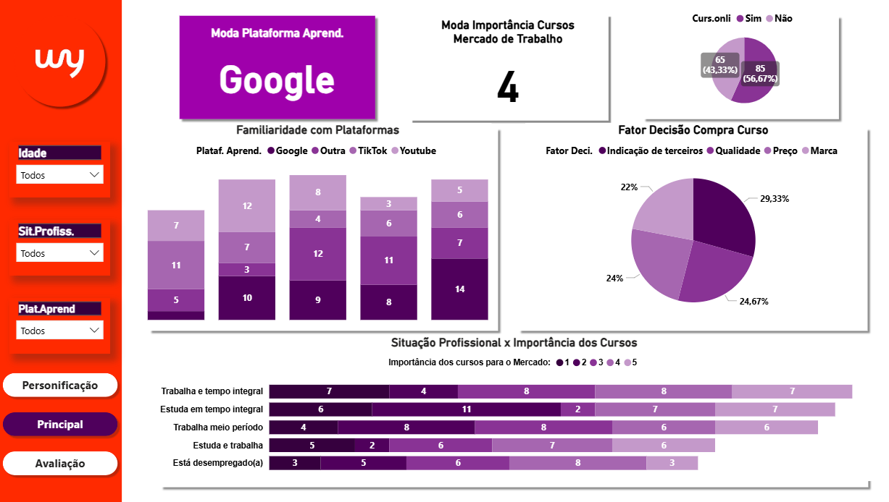
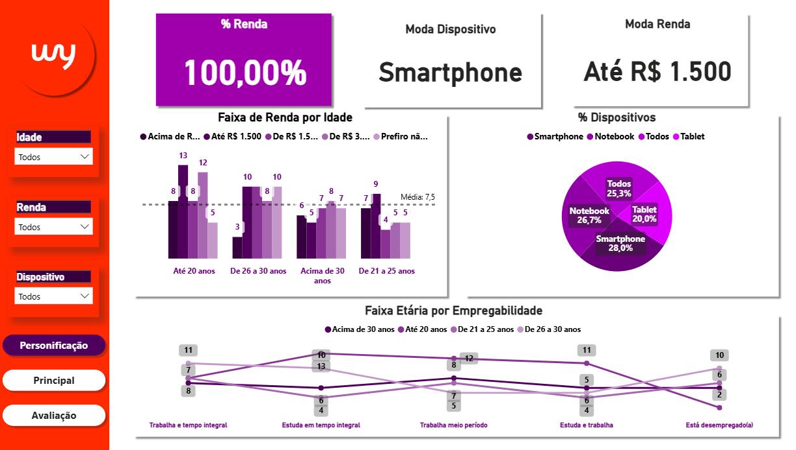
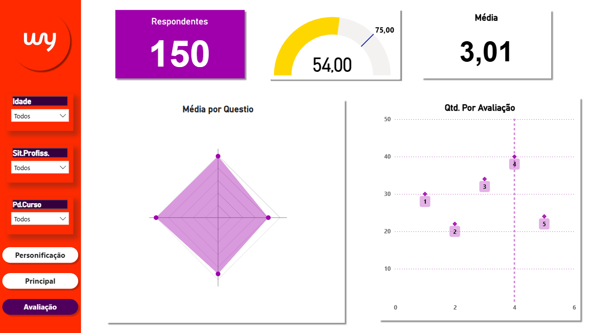

# 📊 Análise e Estatística - Cursos Online

Dashboard desenvolvido em **Power BI** com o objetivo de analisar dados de uma pesquisa sobre cursos online, comportamento de aprendizado e perfil dos respondentes.  
O relatório utiliza **métricas estatísticas (Média e Moda)**, segmentações dinâmicas e medidas DAX para gerar insights sobre comportamento e percepção dos usuários.

***> Esse foi um dos últimos projetos desenvolvidos para finalização do cusro de Ciências da Computação. <***

---

## 🧠 Objetivo
Avaliar o perfil dos respondentes em relação a:
- Faixa etária, renda e situação profissional  
- Familiaridade com plataformas de aprendizado  
- Avaliação geral dos cursos online  
- Fatores que influenciam a decisão de compra e percepção de utilidade dos cursos  

---

## ⚙️ Principais Métricas (DAX)

```DAX
-- Moda da Avaliação do Formulário
ModaAvaliacao =
CALCULATE(
    MAX(Sheet1[Avaliação do formulário (1-5)]),
    TOPN(
        1,
        SUMMARIZE(
            Sheet1,
            Sheet1[Avaliação do formulário (1-5)],
            "Qtd", COUNTROWS(Sheet1)
        ),
        [Qtd],
        DESC
    )
)

-- Valor de Radar (ajuste dinâmico por quesito)
ValorRadar =
SWITCH(
    SELECTEDVALUE(Radar[Quesito]),
    "Participaria novamente", [ParticipariaAjustado],
    "Clareza do questionário", [MédiaClareza],
    "Utilidade da pesquisa", [MédiaUtilidade],
    "Avaliação do formulário", [MédiaAvaliacao]
)

-- Contagem por Plataforma e Familiaridade
ContagemEscalaPorPlataforma =
CALCULATE(
    COUNTROWS(Sheet1),
    ALLEXCEPT(Sheet1, Sheet1[Plataforma de aprendizado buscada], Sheet1[Familiaridade com plataformas online])
)

-- Percentual de Participação
%Participaria = 
AVERAGE('Sheet1'[ParticipariaNumerico]) * 100
```

---

## 📈 Páginas e Visualizações

### 1️⃣ **Página Principal**
- **Indicadores**: Moda da plataforma de aprendizado e importância dos cursos para o mercado.  
- **Gráficos utilizados**:  
  - Barras empilhadas (familiaridade com plataformas)  
  - Gráficos de pizza (fatores de decisão e participação em cursos)  
  - Gráfico de barras empilhadas (situação profissional × importância dos cursos)  
- **Insight:** O **Google** aparece como plataforma mais conhecida, e o fator mais relevante na escolha de cursos é a **indicação de terceiros**, seguido de **qualidade** e **preço**. 

🖼️ Preview:  



---

### 2️⃣ **Página de Personificação**
- **Indicadores**: Moda de renda e dispositivo predominante.  
- **Gráficos utilizados**:  
  - Gráfico de colunas (faixa de renda por idade)  
  - Gráfico de pizza (% por dispositivo)  
  - Gráfico de linhas (faixa etária por empregabilidade)  
- **Insight:** A maioria dos respondentes acessa via **smartphone** e possui renda até **R$ 1.500**, com predominância de jovens até 20 anos.  

🖼️ Preview:  



---

### 3️⃣ **Página de Avaliação**
- **Indicadores**: Total de respondentes, média geral e nível de avaliação do formulário de pesquisa.  
- **Gráficos utilizados**:  
  - Gráfico de radar (Média por quesito)  
  - Gráfico de dispersão (quantidade por nota de avaliação)  
  - Indicadores de KPI (total e média)  
- **Insight:** A média geral de satisfação ficou próxima de 3, com destaque para clareza e utilidade da pesquisa.  
 

🖼️ Preview: 



---

## 🧩 Recursos Utilizados
- **Power BI Desktop** (modelagem e visualização)  
- **Métricas DAX personalizadas**  
- **Segmentadores dinâmicos** (idade, profissão, curso e dispositivo)  
- **Visuals personalizados** (Radar, KPI, Pizza, Dispersão)  
- **Paleta temática:** tons de roxo e vermelho, com layout limpo e intuitivo.  

---

⭐ *Este projeto demonstra a aplicação de DAX, boas práticas de visualização e análise exploratória de dados no Power BI.*
